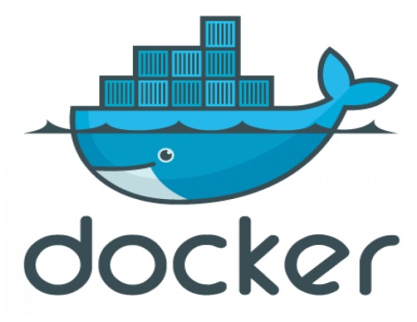

# H1
## H2
### H3


**bold text**
*italicized text*
> blockquote
1. First item
2. Second item
3. Third item

- First item
- Second item
- Third item

`code`

---

[title](https://www.example.com)



| Syntax    | Description |
|-----------|-------------|
| Header    | Title       |
| Paragraph | Text        |

``` json
{
  "firstName": "John",
  "lastName": "Smith",
  "age": 25
}
```

### My Great Heading

term
: definition

~~The world is not flat.~~

- [x] Write the press release
- [ ] Update the website
- [ ] Contact the media
